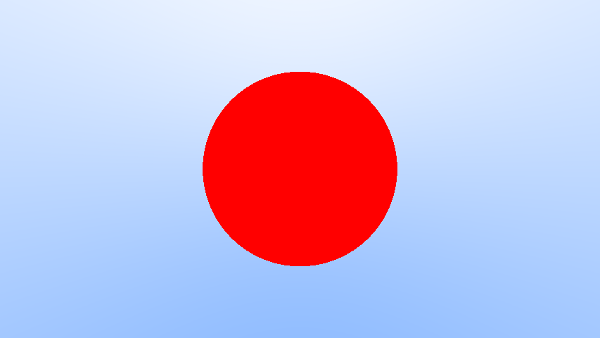

# Raytracer

An implementation of Peter Shirley's [_Ray Tracing in One Weekend_](https://raytracing.github.io/books/RayTracingInOneWeekend.html) in rust, for learning purposes.

## TODO

- [x] Image IO
  - [x] Using [`image.rs`](https://docs.rs/image/latest/image/)
- [x] Math
- [x] a Simple Camera, and Background
- [ ] Adding a Sphere
- [ ] Rest of the shit

## Changelog

**December 23, Friday** - Added a simple camera and background

**December 23, Friday** - Added `Vec3` and `Ray` class

**December 22, Thursday** - Image IO using [`image.rs`](https://docs.rs/image/latest/image/)

> The `image` crate is such a god sent, really made the work way less tedious. It saves in multiple formats! So no PPM troubles.
